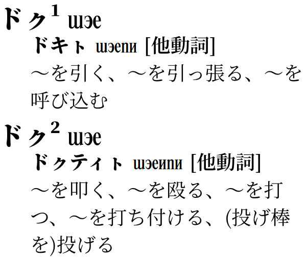
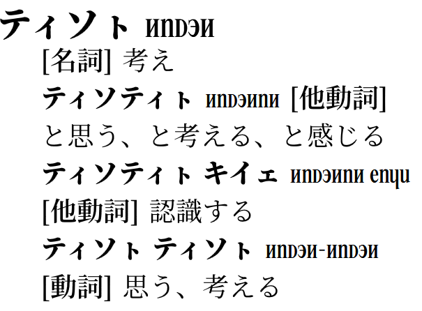
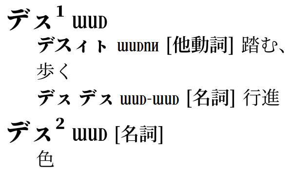
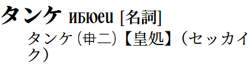
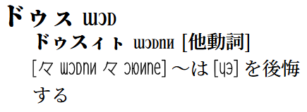

# PMCP 50 音順辞書

## 全体の流れ

- `EDIT_ME_タ.tsv` にタ行の語について書く
- `node build_html.js` により、`vivliostyle/タ.html` を作る
- `cd vivliostyle; npx vivliostyle build -m` により、`nclc-leti-tectelit-leti-lukup-cet.pdf` が出来上がる。トリムマークが要らないなら `-m` を削る。
- 満足したら、柱見出しを手動で割り当てるために `GUIDE_WORDS_タ.json` を編集し、ビルド作業をもう一度行う

`cd vivliostyle; npx vivliostyle build -m` は vivliostyle/build.bat でできる。

なお、vivliostyle/preview.bat を使ってプレビューを立ち上げておくと、「`node build_html.js` により、`vivliostyle/タ.html` を作る」をトリガーにしてプレビューが更新されるので作業しやすい。

どちらのバッチファイルも、エクスプローラーから起動すること。（カレントディレクトリの関係）

## EDIT_ME.tsv の仕様

タブ区切り。

左から

- 親見出し（日本語）	
- 同綴見出し	
- 親見出し（PMCP）	
- 子見出し（日本語）	
- 子見出し（PMCP）	
- 品詞	
- 語釈	
- 品詞欄の直後に改行を強制

の順に並べる。

### 同綴見出し

2 種類の機能を同居させている。

1 つ目の機能は、ここに「`¹`」や「`²`」などの上付き数字を書くことによって、同綴りの見出し語について区別用の数字を辞書に表示するというものである。

例えば、

```
ドㇰ	¹	dok	ドキㇳ	dokit	他動詞	～を引く、～を引っ張る、～を呼び込む	
ドㇰ	²	dok	ドㇰティㇳ	doktit	他動詞	～を叩く、～を殴る、～を打つ、～を打ち付ける、(投げ棒を)投げる	
```

と書くと、こうなる。



2 つ目の機能は、ここに「`*`」と書くことによって、直前・直後の同綴見出し語と同じところにぶら下がるようにするというものである。

例えば、

```
ティソㇳ	*	ticot			名詞	考え	
ティソㇳ	*	ticot	ティソティㇳ	ticotit	他動詞	と思う、と考える、と感じる	
ティソㇳ	*	ticot	ティソティㇳ キイェ	ticotit kije	他動詞	認識する	
ティソㇳ	*	ticot	ティソㇳ ティソㇳ	ticot-ticot	動詞	思う、考える	
```

と書くと、こうなる。



なお、この 2 つの機能を同居させることもできる。この際は、 `*¹` などと書いて、`*` が必ず文字列の先頭に来るようにせよ。

例えば、

```
デㇲ	*¹	dec	デスィㇳ	DECIT	他動詞	踏む、歩く	
デㇲ	*¹	dec	デㇲ デㇲ 	DEC-DEC	名詞	行進	
デㇲ	²	dec			名詞	色	
```

と書くと、こうなる。



### 語釈

向こうの表記で特に燐字を書きたいときのための代用表記を用意している。現状、表示フォントは linzklar_rounded を採用している。

#### 墨付きカッコ

`【】` の中に入れると「`(向こう)【現世転写】`」として表示される。

例えば、

```
タンケ		tanke			名詞	タンケ【皇処】（セッカイク）	
```

と書くと、こうなる。



#### 白抜きカッコ

`〖〗` の中に入れると「`向こう`」として表示される。

例えば、

```
ドゥㇲ		duc	ドゥスィㇳ	ducit	他動詞	〖[或 ducit 或 untik]〗 ～は〖[jo]〗 を後悔する	
```

と書くと、こうなる。




